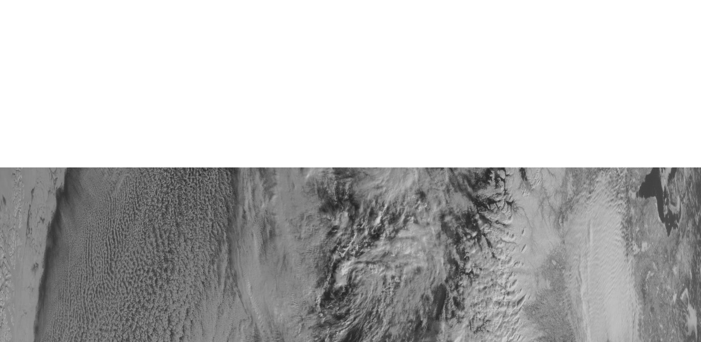
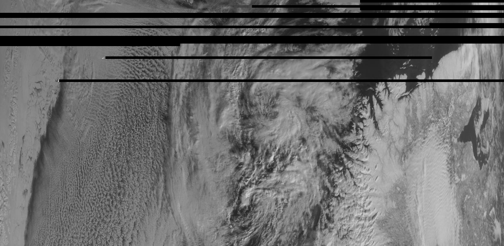
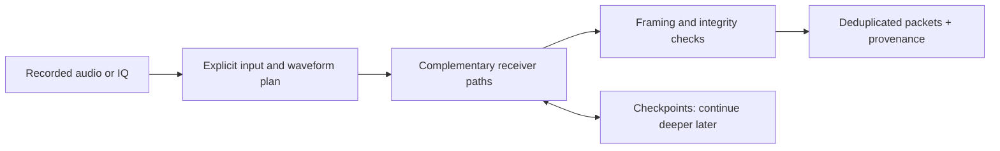
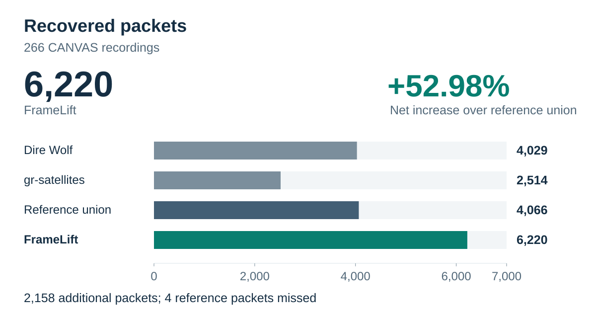
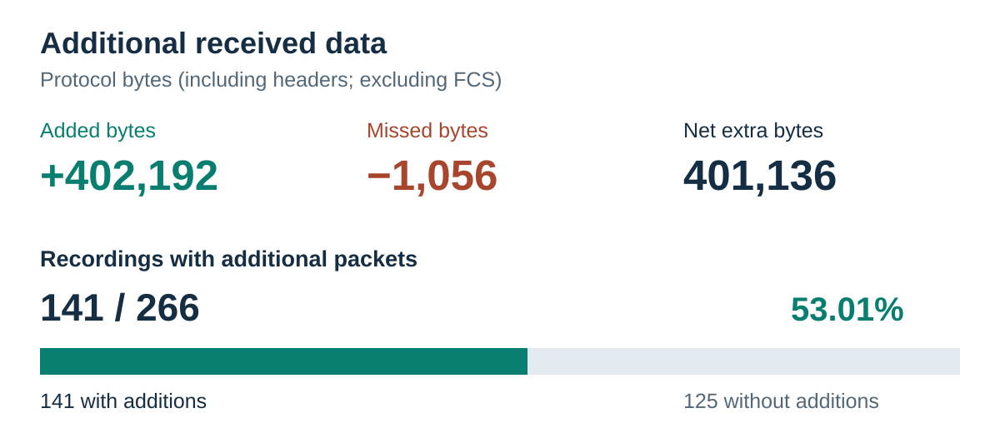
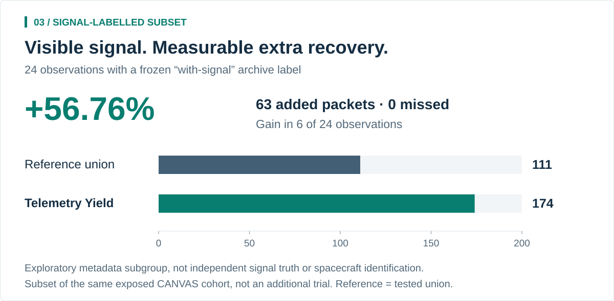

# FrameLift

### More usable telemetry from the recordings you already have.

| SatDump | SatDump + FrameLift |
|:---:|:---:|
|  |  |

**More of the same pass.** Meteor-M2, MSU-MR channel 1: **328 additional image
rows containing received data**, some still incomplete. Same original IQ,
same SatDump image renderer; no gap filling. The blank upper-left area is outside
the baseline's decoded coverage. Selected detail, not a whole-recording benchmark.
[Source, alignment and image checksums](docs/assets/meteor-m2/README.md).

An offline satellite receiver that revisits difficult parts of a recording with
complementary signal-processing methods, retains validated packets, and records
how each result was obtained. The receiver runtime is written in Rust. CPU by default; optional CUDA FIR
acceleration. Independent of the system that captured the recording.

Previously developed as **Telemetry Yield**. The receiver binaries, package names
and frozen research artifacts retain that name for reproducibility.

Repository-wide migration is still in progress: legacy Python research,
acquisition and scheduling tools remain. The receiver does not invoke them.
[Migration status and native replacements](docs/rust-migration-status.md).

[GitHub repository](https://github.com/Ret2Me/FrameLift) ·

[Get started](#get-started) · [How it works](docs/how-it-works.md) ·
[Architecture](docs/architecture.md) · [Comparisons](docs/comparisons.md) ·
[Paper](publication/decoder-paper-v2/main.pdf) · [Documentation](docs/README.md)

## The problem

A visible satellite signal is not the same as decodable telemetry. Noise,
imperfect timing, filtering and channel distortion can prevent a receiver from
recovering a packet. An archived recording lets us spend more computation on
that same signal after the pass has ended.

Telemetry Yield is that **second-pass recovery engine**. It does not create
missing payloads, infer measurements from an image, or turn mono audio back into
phase-preserving IQ. It searches for received packets using a finite, auditable
portfolio of receiver hypotheses.



## What the evidence shows

Completed historical replay of **266 CANVAS recordings**, using the same numerical
audio for each receiver. Packet counts are unique **within each observation**.



The tested Dire Wolf configuration recovered 4,029 packets and gr-satellites
2,514; their deduplicated union is 4,066, compared with 6,220 for the progressive
receiver. That is **2,158 additions and four misses**, not a strict superset.

Net increase: **52.98%**. At least one additional packet in **141/266** recordings.
This is a **previously exposed, single-mission development cohort**, not an
independent holdout or a packet-success probability. The additional recovery costs
substantially more computation. It is not evidence of universal superiority,
better RF sensitivity, or better performance at equal compute.

### Additional received data



These are received protocol bytes, **including headers and excluding FCS**,
not application-only measurements. Identical bytes in different observations can
count again. The observation bar counts recordings with at least one addition;
those recordings can also contain missed reference packets.

### Recordings with a reported signal



This is the **24-observation subset** labelled `waterfall_status=with-signal`
in the frozen archive metadata. It is not an additional independent trial, a
subset chosen by our decoder's success, or proof of spacecraft identity.

[Full results, costs and signal-labelled subgroup](docs/benchmarks.md) ·
[Machine-readable evidence](publication/decoder-paper-v2/evidence/summary.json) ·
[Study limitations](publication/decoder-paper-v2/README.md) ·
[Figure sources and regeneration](docs/assets/recovery/README.md)

## Why this receiver

- **Complementary attempts.** Multiple frontends, timing hypotheses and sequence
  detectors address different failure modes in the same recording.
- **Local channel adaptation.** Independently received packets can calibrate
  nearby, disjoint signal windows. External reference payloads are not training inputs.
- **Progressive execution.** Start with a short budget; resume the same session
  for a deeper pass without repeating committed tasks.
- **Traceable results.** Preserve source identity, executable identity, policy,
  received bytes, integrity evidence and task-level provenance.
- **A reusable receiver core.** Explicit waveform and protocol interfaces, a
  native CLI and structured outputs; no dependency on SatNOGS in the decoding runtime.

These are design choices, not claims that MLSE, timing recovery or offline replay
were invented here. [Differences from Dire Wolf, gr-satellites, SatNOGS and SatDump](docs/comparisons.md)
include their strengths and the boundaries of our measurements.

## Get started

Linux is the supported target. Install Rust through rustup; the repository pins
the toolchain and Cargo dependencies. Install FFmpeg and ffprobe for OGG input.
Native WAV/IQ decoding does not require Python or another decoder.

Run from the repository root:

```sh
cargo build --locked --release --no-default-features --bins
target/release/telemetry-yield-rs capabilities
mkdir -p results

# Mono post-FM FSK/GMSK audio, default 9600 baud. Use your actual recording.
target/release/telemetry-yield-rs decode-progressive \
  --input recording.wav --output results/pass-001 --mode quick --threads 4

# Continue the same input, binary and decoding policy.
target/release/telemetry-yield-rs decode-progressive \
  --input recording.wav --output results/pass-001 --mode full --threads 4 --resume
```

| Mode | Default invocation budget | Intended use |
|---|---|---|
| `quick` | 3 seconds | Early results with explicit incomplete coverage |
| `deep` | 60 seconds | More of the same finite task bank |
| `full` | No time limit | Complete the configured bank |

Budgets are supervised limits, **not hard real-time guarantees**. Preparation and
verification consume time; cleanup may exceed the nominal budget. Check completion
fields before interpreting zero packets. A new run needs a new output directory;
resume requires compatible evidence. IQ and other protocols use the separate
generic `decode` interface, not this progressive audio bank.

[Audio, IQ and metadata examples](docs/rust-receiver.md) ·
[English progressive guide](docs/how-it-works.md#progressive-execution) ·
[Operations](docs/operations.md)

## Supported layers

| Layer | Implemented | Qualification boundary |
|---|---|---|
| Audio | Post-FM FSK/GMSK; Bell-202 AFSK | Main field study: CANVAS 9600-baud audio |
| IQ | FSK, Bell-202, BPSK, QPSK, OQPSK | Explicit plans; PSK field-yield qualification remains open |
| Framing | AX.25, Space Packets/TM, CSP v1/v2, configured AOS/USLP | Mission layout and integrity rules required |
| Coding | Reed–Solomon, selected LDPC/CCSDS presets | Not every code, concatenation or mission service |
| Images | Geoscan assembly; companion Meteor and SSTV tools | Separate pipelines and evidence; no inferred missing pixels |

[Detailed support matrix](docs/support-matrix.md) lists entry points, limitations
and evidence levels. “Implemented” is not synonymous with field-qualified.

## CPU and optional GPU

```sh
cargo build --locked --release --features cuda --bin telemetry-yield-rs
target/release/telemetry-yield-rs --compute cpu --compute-threads 4 compute-info
target/release/telemetry-yield-rs --compute cuda --cuda-device 0 compute-info
```

CUDA currently accelerates real/complex FIR filtering, not the whole receiver.
An unavailable requested GPU fails explicitly; there is no silent CPU fallback.
CPU remains usable without NVIDIA libraries. **Hardware GPU parity and end-to-end
speedup are not yet demonstrated.** [Configuration and qualification](docs/enterprise-compute-and-benchmark-v1.md).

## Build quality and release status

```sh
cargo xtask check          # format, strict lint, tests, Rustdoc, CUDA host checks
cargo xtask research-check # compile retained experiment targets
```

The current build is a **qualification candidate**. The
[dated quality report](reports/repository-quality-20260914.md) records passing
local checks, 195 bit-exact FIR cases, and full 20-frame/1,372-task parity on one
development recording after refactoring. That regression is not a new field trial.
The [CI portability fix passed on GitHub](https://github.com/Ret2Me/FrameLift/actions/runs/35020996678).
Each subsequent revision must pass the [same quality workflow](.github/workflows/quality.yml).

[Contributing](CONTRIBUTING.md) · [Security](SECURITY.md) ·
[Release checklist](docs/release-checklist.md) · [Roadmap](docs/roadmap.md) ·
[Citation](CITATION.md)

## Read the research

The [current paper](publication/decoder-paper-v2/main.pdf) explains the receiver,
equations, experimental protocol, complete-cohort results, compute cost and
limitations in an IEEE-style two-column manuscript. Its
[LaTeX source and reproduction instructions](publication/decoder-paper-v2/README.md)
ship alongside a checksum-bound evidence bundle. It is an **unsubmitted research
draft**, not a peer-reviewed publication.

The [research archive](RESEARCH.md) preserves earlier experiments, including
negative results. The codec-conditioned experimental arm produced **zero extra
packets over its codec-disabled control** in the 266-recording study; the paper
reports that result rather than attributing the main gain to codec conditioning.

## Repository map

```text
rust/          Receiver library, CLI, DSP, protocols and integrity tests
rust/research/ Native cohort, packet, metric and attempt-store tools
rust/archive/  Native archival acquisition, frozen experiments and audited reports
config/rust/   Explicit native receiver plans
tools/xtask/   Maintained developer quality gates
docs/          Product, architecture, comparison and operational guides
publication/   Versioned manuscripts and supporting evidence
reports/       Dated engineering and research reports
examples/      Reproducible experiments and reporting tools
src/, tests/   Retained Python research and reference oracles; not runtime dependencies
```

The [native archival workflow](docs/native-archive-workflow.md) includes an opt-in
marginal-yield scheduler and matched fixed-order controls. Its new benchmark is
separate from the completed 266-recording study above; implementation and unit
tests alone do not establish an additional gain.

Raw recordings, `work/`, caches, frozen local runtimes and bulk experiment outputs
are laboratory material, not a source release. The repository retains narrative
reports, test fixtures and the versioned manuscript evidence bundles. A public
source repository does not imply a permanent archive DOI, SLA or blanket distribution
license. See [third-party attribution](THIRD_PARTY_ATTRIBUTION.md) and
the [release checklist](docs/release-checklist.md) before redistribution.
