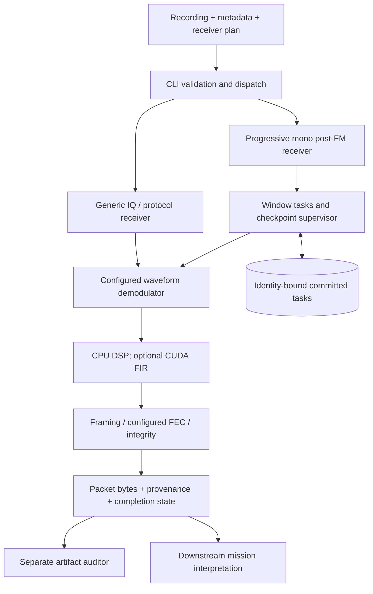
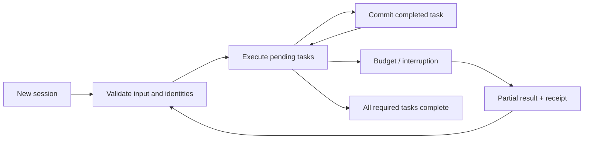

# Receiver architecture

[Documentation](README.md) · [Method](how-it-works.md) · [Support matrix](support-matrix.md)

## System boundary

The receiver starts with recorded samples and explicit configuration. Antenna
control, scheduling, RF capture and mission dashboards belong to the integrating
system. The native receiver does not need the SatNOGS service to decode a local file.

The diagram shows responsibility boundaries, not a promise that every generic
protocol uses the progressive audio portfolio. FEC is selected only by the
applicable link plan. The progressive CANVAS trial does not use all implemented
modulations or coding families.

## Packages and entry points

The package `telemetry-yield-rs` contains the native library and five Linux CLI
programs. `tools/xtask` is development tooling, not a receiver dependency. The
default workspace member remains the receiver; historical examples keep their
original Cargo names and paths.

The workspace excludes `tools/meteor-image-audit` and `work/`: the former keeps
its independent lockfile, and frozen experiment snapshots must remain runnable
as standalone packages. CI checks the image tool separately.

## Responsibility boundaries

| Area | Source | Responsibility |
|---|---|---|
| CLI schema | `rust/cli/args.rs` | Flags, defaults, command descriptions and configuration conversion; no device initialization |
| CLI orchestration | `rust/cli/mod.rs` | Route commands to library APIs; keep compute initialization out of pre-fork supervisors |
| CLI I/O | `rust/cli/io.rs` | Bounded JSON stdin, one JSON stdout record, explicit failure markers |
| Diagnostics | `rust/cli/diagnostics.rs` | Null controls, bit-score work guard and capability inventory |
| Entry point | `rust/main.rs` | Process exit codes and stderr diagnostics only |
| Generic receiver | `rust/generic.rs`, `rust/receiver.rs` | Explicit waveform/protocol plans, window execution and validated results |
| Progressive receiver | `rust/progressive*.rs` | Finite portfolio, durable commits, resumption, deadlines and cancellation |
| Compute | `rust/compute*.rs`, `rust/kernels/` | CPU/CUDA FIR execution, resource configuration and numerical qualification |
| Waveform processing | `rust/dsp.rs`, `rust/psk*.rs`, `rust/sequence.rs` | Signal conditioning, synchronization and sequence decisions |
| Framing and coding | `rust/protocol.rs`, `rust/space_link.rs`, `rust/fec*.rs` | Framing, explicit integrity checks and error-correction primitives |
| Evidence | `rust/audit*.rs`, `rust/compute_session_audit.rs` | Independently validate artifacts and compare full results |
| Research primitives | `rust/research/`, `rust/research_cli.rs` | Offline audits, selection, metrics and SQLite attempts |
| Archival experiments | `rust/archive/`, `rust/archive_cli.rs` | Bounded acquisition, frozen cohorts/runtimes, paired runs and re-audited reports |
| File/process boundary | `rust/input.rs`, `rust/backends.rs` | Bounded input, atomic output and owned external-process execution |

The CLI contains no alternate DSP implementation. Experimental lanes remain
explicit modules/options and preserve their qualification labels. The separate
`telemetry-sstv` and `telemetry-meteor` programs retain their own command schemas;
they are not aliases of the general telemetry CLI.

## Execution and integrity

The resume edge must revalidate the input, binary, policy and backend identity.
It does not mean a new build may consume a checkpoint from an old experiment.
An incomplete result is a first-class state, distinct from zero valid packets.

The optional marginal-yield scheduler adds an immutable decision journal before
each four-task batch. It learns only after the batch barrier, credits duplicate
packets once, and never moves tasks across the frozen anchor-generation phases.
The default fixed-order scheduler remains the controlled comparison. Adaptive
ordering is not pruning, a change to packet validation, or a proven yield gain.

Progressive work is supervised in an owned worker process. The supervisor must
not initialize a CUDA context before fork/exec. A worker initializes the selected
backend, commits complete tasks and publishes snapshots. Committed tasks are
bound to source, executable, policy and backend identity. Resumption validates
those bindings; resource exhaustion cannot authorize a partial-success claim.

The compute layer evaluates independent output samples in parallel while
preserving each FIR sum's operation order. It does not select receiver lanes,
accept frames or interpret mission telemetry. CPU remains usable without CUDA
driver/compiler libraries. Explicit GPU requests fail if unavailable.

Protocol validity, FEC convergence, a received checksum, a repaired checksum,
and transmitter attribution are different evidence levels. Keep them separate
through the API and reports. An auditor must not trust a stored `valid: true`
flag in place of checking received bytes.

## Product versus research

`rust/`, Cargo manifests, fixtures, native configurations and developer tooling
are maintained source. `src/`, Python `tests/`, `examples/`, `research/`,
`publication/` and dated reports retain experiments or supporting analyses;
they are not Python runtime requirements of the receiver.

`work/`, `artifacts/`, build outputs and private datasets are not a source
release. Existing reports may refer to absolute laboratory paths; that is
historical provenance, not a dependency to introduce into production code.
`STATUS-PL.md`, `DATA_CARD.md` and `MODEL_CARD.md` are dated research documents,
not a current deployment certification. The main README links current operating
guidance and preserves the old overview in `RESEARCH.md`.

## Architectural decisions

| Decision | Reason | Trade-off |
|---|---|---|
| Explicit waveform and integrity plans | Reject representation/profile ambiguity before accepting data | Requires mission knowledge; no automatic universal decoder |
| Core library separate from CLI | One DSP implementation for embedding and command-line use | Plugin state must expose a stable resume identity |
| Finite additive portfolio | Makes full-run coverage and comparisons inspectable | Higher compute cost than a single replay configuration |
| Durable task-level commits | Reuse expensive completed work after interruption | Disk usage, hashing and compatibility checks add overhead |
| Source/build/backend-bound evidence | Avoid reusing stale or numerically different results | Rebuilds require fresh sessions and qualification |
| CPU default; optional CUDA feature | No GPU runtime dependency for ordinary installations | GPU scope is currently only FIR, not every expensive stage |
| Separate research and product records | Preserve negative results and historical reproducibility | The repository is larger than a minimal distribution package |

## Extension points

Library integrations register `Demodulator` and `ProtocolDecoder` implementations
through [generic.rs](../rust/generic.rs). Compatibility checks cover sample/symbol
kind, modulation families and declared features. A custom decoder must supply
its actual integrity policy; a plausible byte layout is not enough. Opaque plugin
state needs a stable `resume_identity()` before checkpoint reuse is allowed.

The compute backend does not decide which packets count as telemetry. Keep that
boundary when adding acceleration: numerical parity and evidence admission are
separate checks. [Operations](operations.md) describes process ownership and
failure handling; [reproduction](reproducibility.md) describes scientific evidence.
